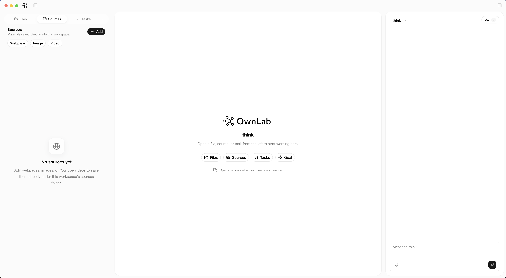
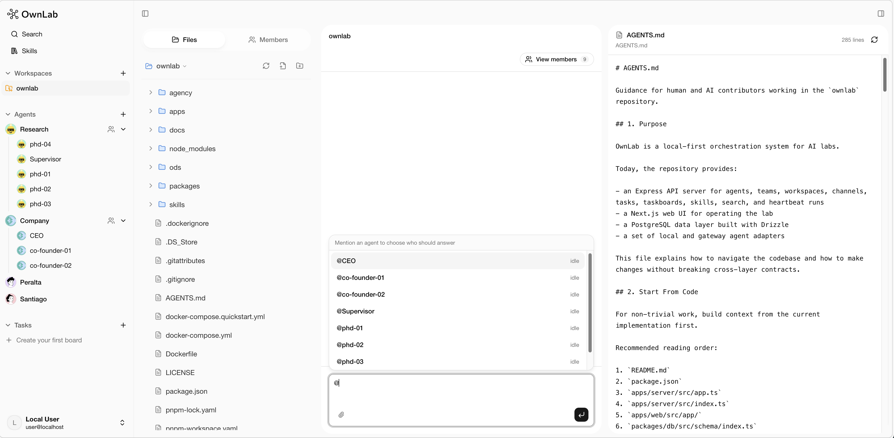
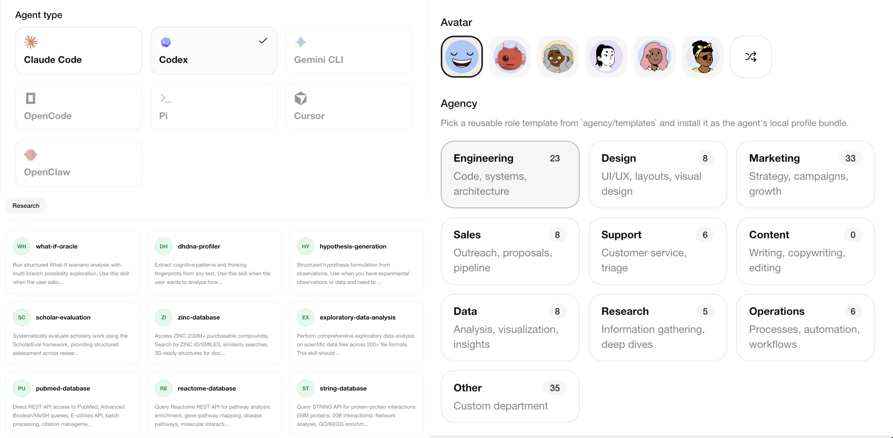
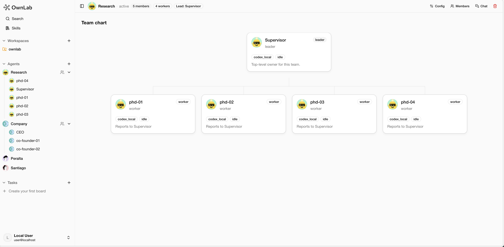
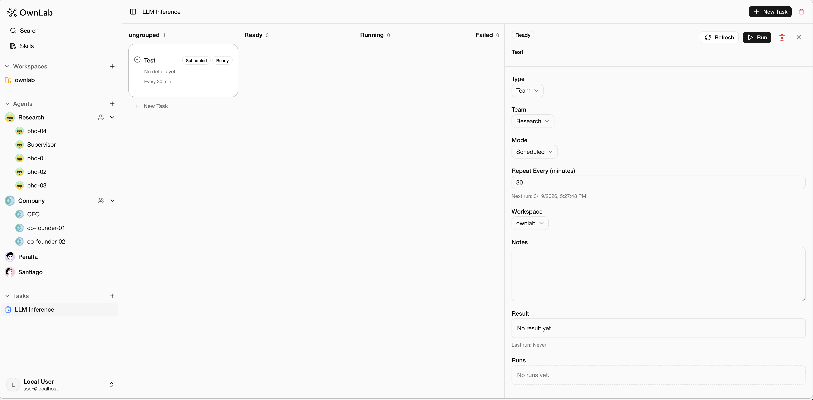

<p align="center">
  
</p>

<p align="center">
  <strong>面向实验室、研究者与 agentic research teams 的开源 AI science workbench。</strong>
</p>

<p align="center">
  <a href="./README.md">English README</a>
</p>

<p align="center">
  
</p>

OwnLab 是一个开源、desktop-first 的 AI workbench，面向科学研究与技术工作。它把 workspaces、specialist agents、可复用 skills、tasks、files、code 和可复现 artifacts 放进同一个 local-first 环境里。

## OwnLab 是做什么的

- ✅ 如果你想要一个面向科学与技术团队的开源 AI workbench，
- ✅ 如果你希望 agents 能阅读论文、检查文件、编写代码、运行工具，并产出可审计的 research artifacts，
- ✅ 如果你希望把实验协议、分析流程、文献综述工作流和领域知识沉淀成可复用 skills，
- ✅ 如果你希望协调 specialist agents 完成研究、工程、数据分析、写作、review 和运营工作，
- ✅ 如果你希望敏感数据集和项目上下文留在自己的机器或基础设施中，
- ✅ 如果你想构建一个自动化实验室、自动化工程团队或自动化公司，那么你应该使用 OwnLab。

## 功能特性

|                                                                 |                                                              |
| --------------------------------------------------------------- | ------------------------------------------------------------ |
| **Workspaces** 把文件、对话、工具、channels 和 artifacts 放在一起。 | **Agents** 构建带有 skills、memory、tools 和 agency 的 specialist runtimes。 |
| **Teams** 将 agents 组织成包含 leaders、reviewers 和 workers 的研究团队。 | **Tasks** 将 scheduled、long-running 或 automatic 工作委派给 agents 和 teams。 |

## 产品预览

| Workspace | Agents |
| --- | --- |
|  |  |

| Teams | Tasks |
| --- | --- |
|  |  |

## 为什么是 OwnLab

现代研究工作被分散在论文、notebooks、数据库、terminal、scripts、cloud compute、团队聊天和 manuscript tools 之间。OwnLab 的目标是让这些工作回到一个连续的研究环境中：

- 用 agents 运行多步骤研究工作流，让它们能够 plan、execute、review 和 iterate。
- 产出带有充分上下文的 artifacts，方便理解它们是如何生成的。
- 用 skills 封装实验协议、分析方法、领域 playbooks 和实验室专属工作流。
- 以 Desktop app 作为主要体验，同时保留 Web app、API server 和 CLI 方便开发与集成。

## 快速开始

环境要求：

- Node.js `20+`
- pnpm `9.15+`

先安装依赖：

```bash
git clone https://github.com/OwnLabAI/ownlab.git
cd ownlab
pnpm install
```

选择你想使用 OwnLab 的方式。

### Web App

在浏览器中使用 OwnLab：

```bash
pnpm dev:web
```

打开：

- Web App: `http://localhost:3000`

### Desktop App

以 local-first 桌面应用的方式使用 OwnLab：

```bash
pnpm dev:desktop
```

## 仓库结构

```text
ownlab/
├── apps/
│   ├── server/        # Express API 与 orchestration services
│   ├── app/           # OwnLab Desktop 使用的 Next.js app runtime
│   ├── desktop/       # Electron desktop shell（推荐的用户使用方式）
│   └── cli/           # `ownlab` CLI（Commander + esbuild）
├── packages/
│   ├── db/            # Drizzle schema、migrations、DB runtime
│   ├── shared/        # Shared types、constants、validation helpers
│   ├── adapter-utils/ # Shared adapter helpers
│   └── adapters/      # Agent adapter packages
├── docs/              # 架构、部署与补充文档
├── ods/               # 产品切片、示例与设计记录
├── package.json
└── pnpm-workspace.yaml
```

## 路线图

- ⚪ 支持更多的Agents
- ⚪ 更灵活的 team 配置
- ⚪ 在 tasks 中支持 auto mode，例如 auto-research
- ⚪ 自动创建 tasks
- ⚪ 更好的文档
